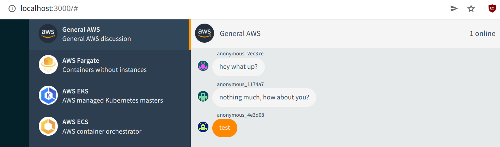
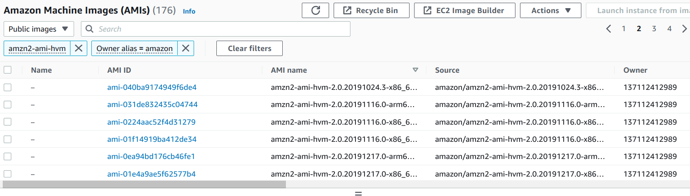
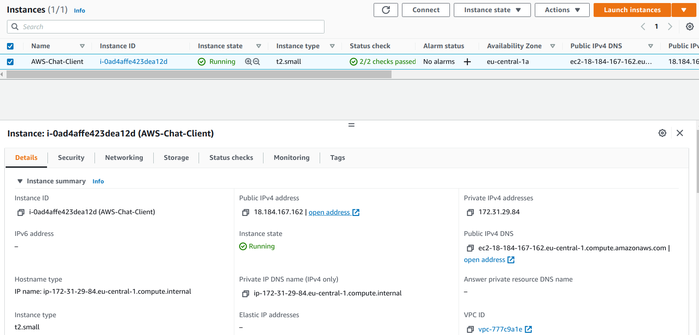

# Solutions

`make build` was showing this error initially:

```bash
❯ make build
CLIENT_IMAGE=095656406992.dkr.ecr.eu-central-1.amazonaws.com/platform/interview/aws-chat:latest docker-compose build client
ERROR: The Compose file './docker-compose.yml' is invalid because:
services.client.depends_on contains an invalid type, it should be an array
make: *** [Makefile:5: build] Error 1
```

To fix this, I updated the docker-compose.yml file `client` section from

```yml
  client:
    depends_on:
      localstack:
        condition: service_healthy
      redis:
        condition: service_healthy
```

to

```yml
  client:
    depends_on:
      - localstack
      - redis
```

I found the solution here https://github.com/moby/moby/issues/30404

## 1 - Create the application Dockerfile

`Dockerfile` for the client app should look like this:

```dockerfile
FROM node:9 AS build
WORKDIR /app
ADD package.json .
RUN npm install

FROM node:9-slim
COPY --from=build /app .
ADD . .
EXPOSE 3000
CMD ["node", "index.js"]
```

The process is rather simple. First, we install the required dependencies defined in the `package.json` with `npm install`.
After that we add all the `client` app files to the image with `ADD . .` and expose the port `3000`. According to the `package.json` definition
main file of the app is `index.js`, and that's what we're executing with the `CMD ["node", "index.js"]` command when a Docker container starts.

`make build` output:

```
❯ make build
CLIENT_IMAGE=095656406992.dkr.ecr.eu-central-1.amazonaws.com/platform/interview/aws-chat:latest docker-compose build client
Building client
Step 1/9 : FROM node:9 AS build
 ---> 08a8c8089ab1
Step 2/9 : WORKDIR /srv
 ---> Running in 7e2bc3cd11b8
Removing intermediate container 7e2bc3cd11b8
 ---> 5daf8efe7bdc
Step 3/9 : ADD package.json .
 ---> 904a425380db
Step 4/9 : RUN npm install
 ---> Running in 35cd001abda8
npm WARN deprecated request@2.87.0: request has been deprecated, see https://github.com/request/request/issues/3142
npm WARN deprecated request-promise-native@1.0.5: request-promise-native has been deprecated because it extends the now deprecated request package, see https://github.com/request/request/issues/3142
npm WARN notice [SECURITY] bcrypt has the following vulnerability: 1 moderate. Go here for more details: https://www.npmjs.com/advisories?search=bcrypt&version=2.0.1 - Run `npm i npm@latest -g` to upgrade your npm version, and then `npm audit` to get more info.
npm WARN notice [SECURITY] lodash has the following vulnerability: 1 high. Go here for more details: https://www.npmjs.com/advisories?search=lodash&version=4.17.21 - Run `npm i npm@latest -g` to upgrade your npm version, and then `npm audit` to get more info.
npm WARN notice [SECURITY] redis has the following vulnerability: 1 low. Go here for more details: https://www.npmjs.com/advisories?search=redis&version=2.8.0 - Run `npm i npm@latest -g` to upgrade your npm version, and then `npm audit` to get more info.
npm WARN deprecated bcrypt@2.0.1: versions < v5.0.0 do not handle NUL in passwords properly
npm WARN notice [SECURITY] socket.io has the following vulnerability: 1 moderate. Go here for more details: https://www.npmjs.com/advisories?search=socket.io&version=2.1.1 - Run `npm i npm@latest -g` to upgrade your npm version, and then `npm audit` to get more info.
npm WARN deprecated har-validator@5.0.3: this library is no longer supported
npm WARN deprecated uuid@3.4.0: Please upgrade  to version 7 or higher.  Older versions may use Math.random() in certain circumstances, which is known to be problematic.  See https://v8.dev/blog/math-random for details.
npm WARN deprecated mkdirp@0.5.1: Legacy versions of mkdirp are no longer supported. Please update to mkdirp 1.x. (Note that the API surface has changed to use Promises in 1.x.)
npm WARN deprecated node-pre-gyp@0.9.1: Please upgrade to @mapbox/node-pre-gyp: the non-scoped node-pre-gyp package is deprecated and only the @mapbox scoped package will recieve updates in the future
npm WARN notice [SECURITY] socket.io-parser has the following vulnerability: 1 high. Go here for more details: https://www.npmjs.com/advisories?search=socket.io-parser&version=3.2.0 - Run `npm i npm@latest -g` to upgrade your npm version, and then `npm audit` to get more info.
npm WARN deprecated buffer@4.9.1: This version of 'buffer' is out-of-date. You must update to v4.9.2 or newer
npm WARN deprecated querystring@0.2.0: The querystring API is considered Legacy. new code should use the URLSearchParams API instead.
npm WARN deprecated uuid@3.1.0: Please upgrade  to version 7 or higher.  Older versions may use Math.random() in certain circumstances, which is known to be problematic.  See https://v8.dev/blog/math-random for details.
npm WARN notice [SECURITY] minimist has the following vulnerability: 1 low. Go here for more details: https://www.npmjs.com/advisories?search=minimist&version=0.0.8 - Run `npm i npm@latest -g` to upgrade your npm version, and then `npm audit` to get more info.
npm WARN notice [SECURITY] xmlhttprequest-ssl has the following vulnerabilities: 1 critical, 1 high. Go here for more details: https://www.npmjs.com/advisories?search=xmlhttprequest-ssl&version=1.5.5 - Run `npm i npm@latest -g` to upgrade your npm version, and then `npm audit` to get more info.

> bcrypt@2.0.1 install /srv/node_modules/bcrypt
> node-pre-gyp install --fallback-to-build

[bcrypt] Success: "/srv/node_modules/bcrypt/lib/binding/bcrypt_lib.node" is installed via remote
npm notice created a lockfile as package-lock.json. You should commit this file.
added 257 packages in 8.821s
Removing intermediate container 35cd001abda8
 ---> 272b2d6280f8
Step 5/9 : FROM node:9-slim
 ---> e20bb4abe4ee
Step 6/9 : COPY --from=build /srv .
 ---> c59f97ca5287
Step 7/9 : ADD . .
 ---> 11a0db7293fd
Step 8/9 : EXPOSE 3000
 ---> Running in 57a53113a9e8
Removing intermediate container 57a53113a9e8
 ---> cc5ab72463a8
Step 9/9 : CMD ["node", "index.js"]
 ---> Running in d666e6e432b9
Removing intermediate container d666e6e432b9
 ---> 54c113e7bf9f
Successfully built 54c113e7bf9f
Successfully tagged 095656406992.dkr.ecr.eu-central-1.amazonaws.com/platform/interview/aws-chat:latest
```

I used an intermediate `build` layer in the docker build process in order to reduce the total size of the docker image.

Size of the image without the `build` layer:

```
❯ docker images
REPOSITORY                                                                    TAG                        IMAGE ID       CREATED         SIZE
095656406992.dkr.ecr.eu-central-1.amazonaws.com/platform/interview/aws-chat   latest                     e7c30ce9437d   6 seconds ago   736MB
```

Size of the image with the `build` layer:

```
❯ docker images
REPOSITORY                                                                    TAG                        IMAGE ID       CREATED              SIZE
095656406992.dkr.ecr.eu-central-1.amazonaws.com/platform/interview/aws-chat   latest                     54c113e7bf9f   4 seconds ago        229MB
```

Start the docker compose with `make run`. The output should look like this:

```
❯ make run
CLIENT_IMAGE=095656406992.dkr.ecr.eu-central-1.amazonaws.com/platform/interview/aws-chat:latest docker-compose -p chat-app up -d
Creating network "chat-app_chat" with the default driver
Creating chat-app_localstack_1 ... done
Creating chat-app_redis_1      ... done
Creating chat-app_client_1     ... done
```

Check that containers are up and healthy with `docker ps`. The output should look like this:

```
❯ docker ps
CONTAINER ID   IMAGE                                                                                COMMAND                  CREATED          STATUS                    PORTS                                                                NAMES
5947ed477139   095656406992.dkr.ecr.eu-central-1.amazonaws.com/platform/interview/aws-chat:latest   "node index.js"          14 seconds ago   Up 13 seconds             0.0.0.0:3000->3000/tcp, :::3000->3000/tcp                            chat-app_client_1
33c4af527bf8   localstack/localstack:latest                                                         "docker-entrypoint.sh"   15 seconds ago   Up 13 seconds (healthy)   4510-4559/tcp, 5678/tcp, 0.0.0.0:4566->4566/tcp, :::4566->4566/tcp   chat-app_localstack_1
a7b24b18870e   redis                                                                                "docker-entrypoint.s…"   15 seconds ago   Up 13 seconds (healthy)   0.0.0.0:6379->6379/tcp, :::6379->6379/tcp                            chat-app_redis_1
```

The application is now available locally on `http://localhost:3000`



Run the tests with `make test`. The output should look like this:

```
❯ make test
docker-compose -f docker-compose.test.yml -p chat-app run  --no-deps test


  The application server
    ✓ should serve webpages over HTTP
    ✓ should have a socket.io server

  The API
    ✓ should accept a connection and emit "presence" to it
    ✓ should respond to "room list" with a list of rooms (103ms)
    ✓ should reject "new message" from unauthenticated users
    ✓ should handle "anonymous user" properly
    ✓ when another client connect server should emit correct "presence"
    ✓ when unauthenticated client tries to send message it should be rejected (104ms)
    ✓ when other client joins server should emit "user joined"
    ✓ when authenticated client tries to send malformed message it should be rejected
    ✓ when authenticated client sends good message it should be emitted to all (92ms)
    ✓ when other authenticated client sends good message it should be emitted to all
    ✓ fetching the "message list" should return the right messages in the right order (96ms)
    ✓ when other client disconnects server should emit "user left"


  14 passing (510ms)
```


## 2 - Add REDIS_ENDPOINT environment variable

I looked at the `src/client/lib/config.js` and found several environment variables already defined there.
So I added the `REDIS_ENDPOINT` and `REDIS_PORT` to the file. `REDIS_PORT` defaults to the value `6379` in case an environment variable isn't provided.
File should look like this after the update:

```js
var AWS = require('aws-sdk');

module.exports = {
  ENV_NAME: process.env.ENV_NAME,

  PORT: process.env.PORT || 3000,
  REGION: process.env.REGION || 'eu-central-1',

  REDIS_ENDPOINT: process.env.REDIS_ENDPOINT,
  REDIS_PORT: process.env.REDIS_PORT || 6379,
  DYNAMODB_ENDPOINT: new AWS.Endpoint(process.env.DYNAMODB_ENDPOINT || 'https://dynamodb.eu-central-1.amazonaws.com'),

  // Controls how often clients ping back and forth
  HEARTBEAT_TIMEOUT: 8000,
  HEARTBEAT_INTERVAL: 4000
};

module.exports.SELF_URL = process.env.SELF_URL || 'http://localhost:' + module.exports.PORT;
```

After making this change, we need to update the `src/client/server.js` to properly load this environment variable.
Change the line `io.adapter(redis({ host: 'redis', port: 6379 }));` to `io.adapter(redis({ host: config.REDIS_ENDPOINT, port: config.REDIS_ENDPOINT }));`

Final change is in the `docker-compose.yml`, where the `client` service should be extended with additional environment variable `REDIS_ENDPOINT`
that will have the value `redis`.

`client` section in the `docker-compose.yml` file should look like this after the change:

```yml
  # The actual client application
  client:
    depends_on:
      - localstack
      - redis
    networks:
      - chat
    build: ./src/client
    image: ${CLIENT_IMAGE}
    environment:
      LOCAL: "true"
      ENV_NAME: test
      REDIS_ENDPOINT: redis
      DYNAMODB_ENDPOINT: http://localstack:4566
      AWS_ACCESS_KEY_ID: test
      AWS_SECRET_ACCESS_KEY: test
    ports:
      - 3000:3000
```

Docker container for the `client` should be rebuilt with `make build` after making this change.

## 3 - Configure Amazon Linux 2 AMI

Create a new file named `data.tf` in the `terraform` folder. Content of the file should be the following:

```bash
data "aws_ami" "amazon_linux_2_ami" {
  most_recent = true
  owners      = ["amazon"]

  filter {
    name   = "owner-alias"
    values = ["amazon"]
  }

  filter {
    name   = "name"
    values = ["amzn2-ami-hvm*"]
  }
}
```

Docs for the data source are available here: https://registry.terraform.io/providers/hashicorp/aws/latest/docs/data-sources/ami

We're using the latest Amazon Linux 2 AMI (that's the line `most_recent = true`). In order to match the correct AMI, two filters are used.
First one is filtering based on the `owner-alias`, which is `amazon` in our case.
The second one is filtering based on the AMI name, which is always contains `amzn2-ami-hvm` at the beginning of the name. I found this by searching the list of AMIs
in Amazon EC2 GUI, based on the docs here https://docs.aws.amazon.com/AWSEC2/latest/UserGuide/finding-an-ami.html. Screnshot below shows how the naming actually looks like in the GUI:



Now, we need to reference the AMI from the data source above in our launch template. Update the line `image_id = "ami-xxxxx"` in the resource `resource "aws_launch_template" "aws_chat"` in `main.tf` to `image_id = data.aws_ami.amazon_linux_2_ami.image_id`.

After updating the AMI image ID in the resource, terraform plan will show the following:

```
  # aws_launch_template.aws_chat will be created
  + resource "aws_launch_template" "aws_chat" {
      + arn                    = (known after apply)
      + default_version        = (known after apply)
      + id                     = (known after apply)
      + image_id               = "ami-056343e91872518f7"
      + instance_type          = "t2.small"
      + key_name               = "aws-chat"
      + latest_version         = (known after apply)
      + name                   = (known after apply)
      + name_prefix            = "aws-chat-"
      + tags_all               = (known after apply)
      + user_data              = "I2Nsb3VkLWNvbmZpZwoKIwojIFNpbXBsZSBEb2NrZXIgU3lzdGVtZCBVbml0CiMKb3V0cHV0OiB7IGFsbDogInwgdGVlIC1hIC92YXIvbG9nL2Nsb3VkLWluaXQtb3V0cHV0LmxvZyIgfQoKd3JpdGVfZmlsZXM6CiAgLSBwYXRoOiAvZXRjL3N5c3RlbWQvc3lzdGVtL2F3c2NoYXQuc2VydmljZQogICAgcGVybWlzc2lvbnM6IDA2NDQKICAgIG93bmVyOiByb290OnJvb3QKICAgIGNvbnRlbnQ6IHwKICAgICAgW1VuaXRdCiAgICAgIERlc2NyaXB0aW9uPUFXUyBDaGF0CiAgICAgIFJlcXVpcmVzPWRvY2tlci5zZXJ2aWNlCiAgICAgIFJlcXVpcmVzPXByb2Mtc3lzLWZzLWJpbmZtdF9taXNjLm1vdW50CiAgICAgIEFmdGVyPWRvY2tlci5zZXJ2aWNlCgogICAgICBbU2VydmljZV0KICAgICAgUmVzdGFydD1hbHdheXMKICAgICAgRXhlY1N0YXJ0UHJlPS0vdXNyL2Jpbi9kb2NrZXIgc3RvcCBhd3MtY2hhdAogICAgICBFeGVjU3RhcnRQcmU9LS91c3IvYmluL2RvY2tlciBybSAtZiBhd3MtY2hhdAogICAgICBFeGVjU3RhcnRQcmU9L2Jpbi9iYXNoIC1jICIvYmluL2F3cyBlY3IgZ2V0LWxvZ2luLXBhc3N3b3JkIC0tcmVnaW9uIGV1LWNlbnRyYWwtMSB8IGRvY2tlciBsb2dpbiAtLXVzZXJuYW1lIEFXUyAtLXBhc3N3b3JkLXN0ZGluIDA5NTY1NjQwNjk5Mi5ka3IuZWNyLmV1LWNlbnRyYWwtMS5hbWF6b25hd3MuY29tL3BsYXRmb3JtL2ludGVydmlldy9hd3MtY2hhdCIKICAgICAgRXhlY1N0YXJ0UHJlPS91c3IvYmluL2RvY2tlciBwdWxsIDA5NTY1NjQwNjk5Mi5ka3IuZWNyLmV1LWNlbnRyYWwtMS5hbWF6b25hd3MuY29tL3BsYXRmb3JtL2ludGVydmlldy9hd3MtY2hhdAogICAgICBFeGVjU3RhcnQ9L2Jpbi9iYXNoIC1jICJkb2NrZXIgcnVuIC0tbmFtZSBhd3MtY2hhdCBcCiAgICAgICAgICAgICAgICAgICAgICAgICAgICAgIC0tZW52LWZpbGUgL2hvbWUvZWMyLXVzZXIvYXdzY2hhdC5lbnYgLXAgODA6MzAwMCBcCiAgICAgICAgICAgICAgICAgICAgICAgICAgICAgIDA5NTY1NjQwNjk5Mi5ka3IuZWNyLmV1LWNlbnRyYWwtMS5hbWF6b25hd3MuY29tL3BsYXRmb3JtL2ludGVydmlldy9hd3MtY2hhdCIKICAgICAgRXhlY1N0b3A9L3Vzci9iaW4vZG9ja2VyIHN0b3AgYXdzLWNoYXQKCiAgICAgIFtJbnN0YWxsXQogICAgICBXYW50ZWRCeSA9IG11bHRpLXVzZXIudGFyZ2V0CgogIC0gcGF0aDogL2hvbWUvZWMyLXVzZXIvYXdzY2hhdC5lbnYKICAgIHBlcm1pc3Npb25zOiAwNjQ0CiAgICBvd25lcjogZWMyLXVzZXI6ZWMyLXVzZXIKICAgIGNvbnRlbnQ6IHwKICAgICAgUkVHSU9OPWV1LWNlbnRyYWwtMQogICAgICBFTlZfTkFNRT1wcm9kCgpydW5jbWQ6CiAgLSAneXVtIC15IHVwZGF0ZScKICAtICdhbWF6b24tbGludXgtZXh0cmFzIGluc3RhbGwgZG9ja2VyJwogIC0gJ3VzZXJtb2QgLWEgLUcgZG9ja2VyIGVjMi11c2VyJwogIC0gJ3N5c3RlbWN0bCBkYWVtb24tcmVsb2FkJwogIC0gJ3N5c3RlbWN0bCBlbmFibGUgZG9ja2VyJwogIC0gJ3N5c3RlbWN0bCBzdGFydCBkb2NrZXInCiAgLSAnc3lzdGVtY3RsIHN0YXJ0IGF3c2NoYXQn"
      + vpc_security_group_ids = (known after apply)

      + block_device_mappings {
          + device_name = "/dev/xvda"

          + ebs {
              + encrypted   = "true"
              + iops        = (known after apply)
              + throughput  = (known after apply)
              + volume_size = 20
              + volume_type = "gp2"
            }
        }

      + iam_instance_profile {
          + arn = (known after apply)
        }

      + metadata_options {
          + http_endpoint               = (known after apply)
          + http_protocol_ipv6          = (known after apply)
          + http_put_response_hop_limit = (known after apply)
          + http_tokens                 = (known after apply)
        }
    }
```

Notice that `image_id = "ami-056343e91872518f7"` is used now. Terrafom data source retrieved the latest available Amazon Linux 2 AMI and assigned it to the launch template.

In the end, you run `terraform apply` on the code. The output should be similar to this:

```
Plan: 13 to add, 0 to change, 0 to destroy.

Do you want to perform these actions?
  Terraform will perform the actions described above.
  Only 'yes' will be accepted to approve.

  Enter a value: yes

aws_key_pair.aws_chat: Creating...
aws_default_subnet.euce1: Creating...
aws_iam_policy.aws_chat: Creating...
aws_dynamodb_table.users: Creating...
aws_iam_role.aws_chat: Creating...
aws_dynamodb_table.messages: Creating...
aws_security_group.aws_chat: Creating...
aws_key_pair.aws_chat: Creation complete after 0s [id=aws-chat]
aws_default_subnet.euce1: Creation complete after 0s [id=subnet-f656b79f]
aws_iam_policy.aws_chat: Creation complete after 1s [id=arn:aws:iam::091535190231:policy/aws_chat]
aws_iam_role.aws_chat: Creation complete after 2s [id=aws-chat]
aws_iam_role_policy_attachment.aws_chat: Creating...
aws_iam_instance_profile.aws_chat: Creating...
aws_security_group.aws_chat: Creation complete after 2s [id=sg-0eae99f0e354b663c]
aws_security_group.redis: Creating...
aws_iam_role_policy_attachment.aws_chat: Creation complete after 1s [id=aws-chat-20220316190320193700000001]
aws_iam_instance_profile.aws_chat: Creation complete after 1s [id=aws_chat]
aws_launch_template.aws_chat: Creating...
aws_launch_template.aws_chat: Creation complete after 1s [id=lt-0012e6c9c02604cfa]
aws_autoscaling_group.aws_chat: Creating...
aws_security_group.redis: Creation complete after 3s [id=sg-097f417b79c9d344e]
aws_elasticache_cluster.aws_chat: Creating...
aws_dynamodb_table.messages: Creation complete after 8s [id=prod_Messages]
aws_dynamodb_table.users: Creation complete after 8s [id=prod_Users]
aws_autoscaling_group.aws_chat: Still creating... [10s elapsed]
aws_elasticache_cluster.aws_chat: Still creating... [10s elapsed]
aws_autoscaling_group.aws_chat: Still creating... [20s elapsed]
aws_elasticache_cluster.aws_chat: Still creating... [20s elapsed]
aws_autoscaling_group.aws_chat: Still creating... [30s elapsed]
aws_elasticache_cluster.aws_chat: Still creating... [30s elapsed]
aws_autoscaling_group.aws_chat: Still creating... [40s elapsed]
aws_elasticache_cluster.aws_chat: Still creating... [40s elapsed]
aws_autoscaling_group.aws_chat: Creation complete after 46s [id=terraform-20220316190321935500000004]
aws_elasticache_cluster.aws_chat: Still creating... [50s elapsed]
aws_elasticache_cluster.aws_chat: Still creating... [1m0s elapsed]
aws_elasticache_cluster.aws_chat: Still creating... [1m10s elapsed]
aws_elasticache_cluster.aws_chat: Still creating... [1m20s elapsed]
aws_elasticache_cluster.aws_chat: Still creating... [1m30s elapsed]
aws_elasticache_cluster.aws_chat: Still creating... [1m40s elapsed]
aws_elasticache_cluster.aws_chat: Still creating... [1m50s elapsed]
aws_elasticache_cluster.aws_chat: Still creating... [2m0s elapsed]
aws_elasticache_cluster.aws_chat: Still creating... [2m10s elapsed]
aws_elasticache_cluster.aws_chat: Still creating... [2m20s elapsed]
aws_elasticache_cluster.aws_chat: Still creating... [2m30s elapsed]
aws_elasticache_cluster.aws_chat: Creation complete after 2m34s [id=aws-chat]

Apply complete! Resources: 13 added, 0 changed, 0 destroyed.
```

That's it. The infrastructure is deployed and your app is running in the AWS.


